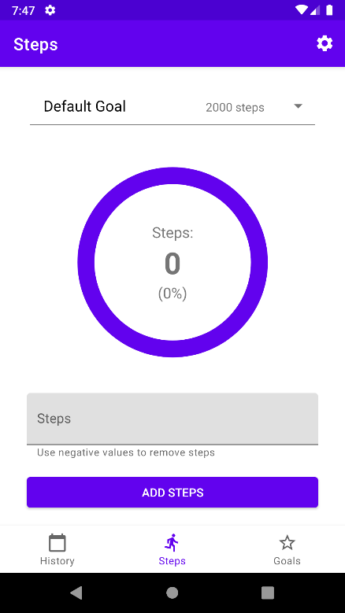
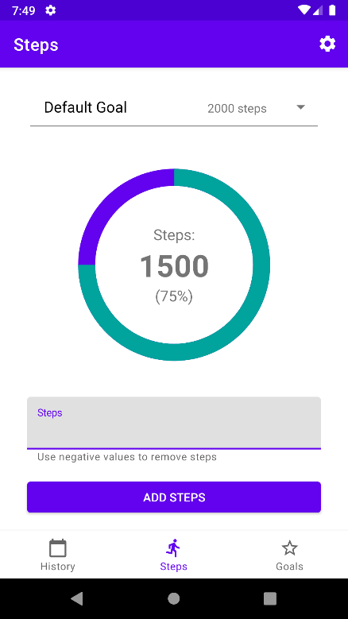
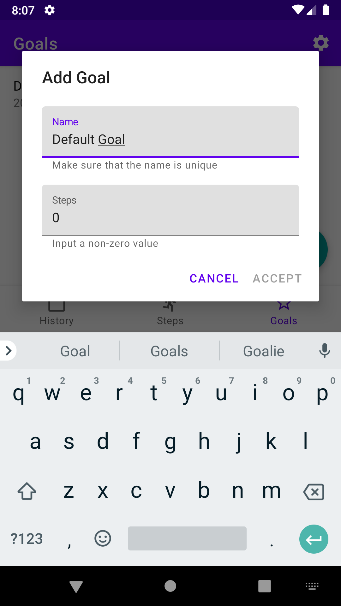
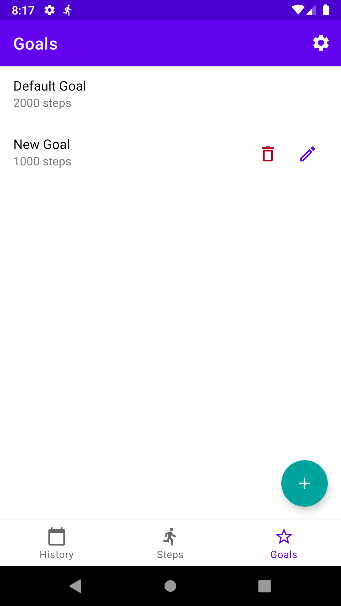
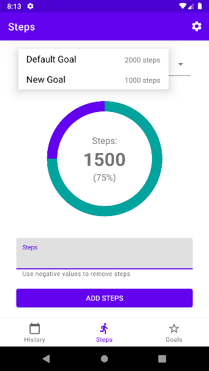
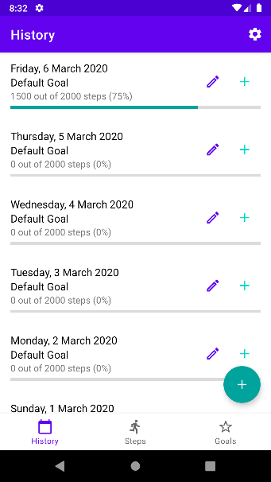
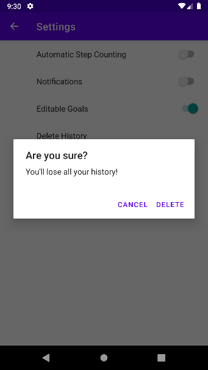
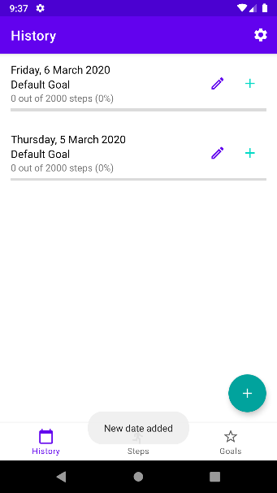
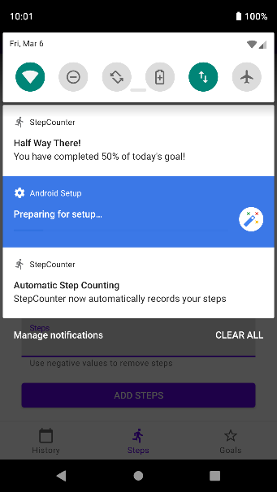
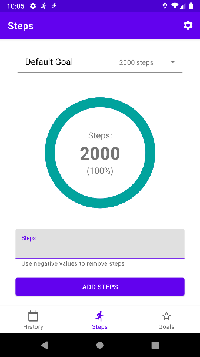

# Step Counter

An implementation of a university mobile development coursework assignment. An excerpt from the submission design description can be found below.

## Design

The Android application was designed in Kotlin following the latest best practices, utilising the MVVM architecture with two top level Activities (Main and Settings), Fragments and Dialogs inflating their respective XML Layouts, ViewModels containing observable LiveData and utilising Data Binding on the UI where appropriate. Persistence in handled by Room Database with Dao classes. Strings and Style are extracted into XML Resource files. Settings are handled natively using Android Preferences. Automatic Step Counting runs as a Foreground Service to avoid being killed by OS. Notifications run as a Service to work in the background when Automatic Step Counting is active and notify user on the lock screen when target is reached. BroadcastReceiver listens for DATE_CHANGED from the OS to smoothly transition at midnight. Recycle View with custom item layout is used for both Goals and History. The overall UI design tries to follow the Material Design guidelines as much as possible.

### Screenshots

#### 1. Activity Recording

Room database stores the days and goals. MainActivity handles bottom navigation between three fragments. SharedViewModel obtained from ViewModelProvider (shared between the steps, history and goals fragments since they all modify the same data in similar fashion) observes the database using LiveData, getting goals and days and utilising Transformation.map to get current day and active goal. The ViewModel is then bound to the StepsFragment which contains a Spinner for goal selection, TextViews for displaying the steps and percentage, ProgressBar, TexInputLayout for input and lastly Button. Negative step recording is allowed with negative and overflow value handling.

</img>
</img>
</img>

### 2. Multiple Goals

Similar as stage 1. Here RecycleView is displaying the goals. Custom ViewHolder is used to provide the item layout with goal name, steps and edit/delete buttons. DiffUtil.ItemCallback is used to optimise list updating (updates only items that have been modified). FloatingActionButton used for goal adding. Custom GoalDialogFragment used for goal add/edit dialog with its own GoalDialogViewModel to provide proper user input validation with DB access (is name valid; does name exist; are steps valid), where the ‘Accept’ button only becomes available if the input is correct (this is directly following the Material Design guidelines). AlertDialog is used for delete confirmation.

</img>
</img>
</img>
</img>
</img>
</img>
</img>
</img>

### 3. History

Similar as stage 1 and 2. RecycleView again with another custom ViewHolder etc. with TextViews for displaying dates, goal names for that date, steps completed out of target including percentage, Buttons for addSteps/editGoal and ProgressBar for displaying the progress. Action to delete history is in settings, using onPreferenceTreeClick to spawn a new confirmation AlertDialog and then deleting all days except today from database and wiping any progression from today, resulting in a ‘fresh start’.

</img>
</img>
</img>
</img>

### 4. History Recording

History editing is handled directly in HistoryFragment. FloatingActionButton opens a DatePickerDialog to add new date to history. Toast used for confirmation that date has been added or that the date already exists (if that is the case). The ‘edit’ and ‘plus’ Buttons open DialogFragment with Spinner to select a goal or EditText to add steps respectively. Modifications are saved to DB and reflected in UI.

</img>
</img>
</img>
</img>
</img>
</img>
</img>
</img>

### 5. Preferences and Settings

The SettingsActivity’s SettingFragment extends the native PreferenceFragmentCompat and by default prepopulates the preferences form an XML resource. SwitchPreferenceCompat used for Boolean settings, plain Preference is used for history deletion. PreferenceManager is used throughout the app to obtain SharedPreferences. ObservablePreferences utility class is provided, which maps LiveData to each Preference. This is then observed in various location in the app to provide desired functionality.

</img>
</img>
</img>

### 6. Notifications

NotificationService is started if notifications are turned on. It runs on the background when the app is running or when automatic step counting runs in the foreground. It observes today’s steps from the DB and displays a notification when >=50% of steps and >=100% steps were achieved, displaying a motivational message and the actual percentage of steps achieved. They also appear on lock screen.

</img>
</img>
</img>
</img>

### 7. Sensor Integration

StepsSensorService extends Service and SensorEventListener, using SensorManager to get the Sensor TYPE_STEP_COUNTER and then implementing onSensorChanged to listen for sensor updates and updating the DB to add steps. It is a Foreground Service with a notification displayed when running.

</img>
